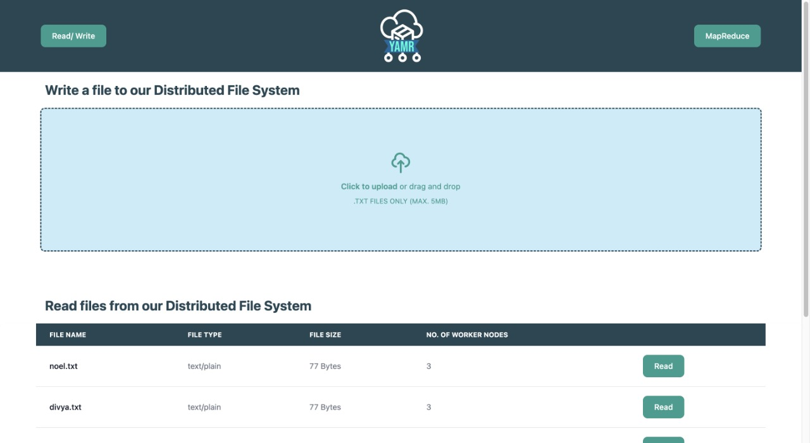
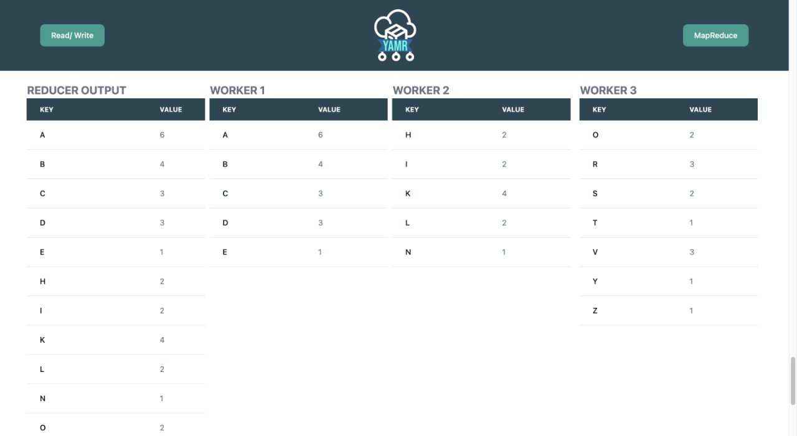

# YAMR - Yet Another Map Reduce

YAMR is our implementation of a system with a Distributed File System which has the capability of performing MapReduce. This was a semester project for our Big Data course UE20CS322.

## Architecture

This project uses Docker to implement the multi node environment and the setup includes 1 Client Node, 1 Master Node and 3 Worker Nodes.
The Client is a React frontend which exposes PORT 3000 to the user to interact with.
The Master Node is an Express.js server which exposes PORT 2000 for the Client Node to interact with and has its own metadata which keeps track of the files present in the Distributed File System.
The 3 worker nodes are also Express.js servers which have their own volumes to store data.

## Running the project
 
1. Clone the repo
2. Make sure you have docker installed on your system
3. Run the command `docker-compose up` and wait till all 5 containers start running
4. Go to `localhost:3000` on your browser to interact with the YAMR website
5. Upload `test.txt` to the DFS
6. Go to the MapReduce section and upload `mapper.js` and `reducer.js` and write the file name as `test.txt`
7. Click on the MAP, PARTITION and REDUCE Buttons to view the outputs

## Replicating data from within container
- To view the contents of the folder within the docker container, run the following command after replacing YOUR_CLONE_PATH
`sudo docker cp yet_another_map_reduce-worker_node-3-1:/app/data3 ~/YOUR_CLONE_PATH/yet_another_map_reduce/worker_node`

- To view the metadata which is stored in the Master node, run the following command after replacing YOUR_CLONE_PATH
`sudo docker cp yet_another_map_reduce-master_node-1:/app/data3 ~/YOUR_CLONE_PATH/yet_another_map_reduce/master_node`

## Routes
### Write Operation

On master node - 
  `POST /splitnormal` - Receives req.files.masterfile
On worker node - 
  `POST /data` - Receives req.body.arr req.body.num req.body.name

### Read Operation

On master node - 
  `GET /read/:name` - :name should be a file of the format hello.txt

On worker node - 
  `POST /read` - Receives req.body.num req.body.name

### Mapper

On master node -
`POST /mapper/:name` - :name should be a file of the format hello.txt

On worker node- 
`POST /mapper/` - req.body.name should be a file of the format hello

### Shuffling function(partition)

On master node -
`GET /shuffle/:name` - :name should be a file of the format hello.txt

On worker node -
`POST /shuffledata` - Receives req.body.arr req.body.num req.body.name

## Limitations

- This project currently accepts files which contain 1 word on each line. This was done for simplicity purposes but can be updated by changing the delimiter from "\n" to " "
- The mapper needs to be a JavaScript Function which accepts the file name that needs to be mapped on and reads the file from within the container.

## Images of the Website

 
 

